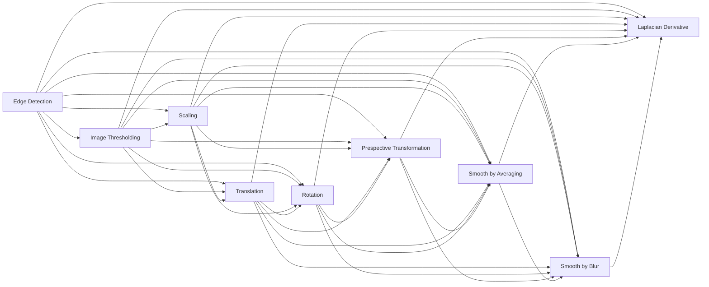

# 🖼️ Distributed Image Processing System

This repository has some files that aims to create a distributed image processing system using Python Celery.

## Requirements

```zsh
pip install celery numpy scipy
```

## Function of `task.py`

The `tasks.py` defines a number of functions that perform various image processing operations. Here is a brief description of each function:

- `edgeDetection`: This function applies the Canny edge detection algorithm to an image, using the median of the image's pixel intensities as a threshold.
- `imageThresholding`: This function applies a simple threshold to an image, setting all pixels below a certain value to black and all others to white.
- `scaling`: This function scales an image.
- `translation`: This function translates (shifts) an image.
- `rotation`: This function rotates an image.
- `prespectiveTransformation`: This function applies a perspective transformation to an image.
- `smoothBy_Averaging`: This function smooths an image by averaging the pixel values within a kernel.
- `smoothBy_Blur`: This function smooths an image using a blur filter.
- `laplacianDerivative`: This function applies the Laplacian derivative to an image, which can be used for edge detection.

### Flowchart


