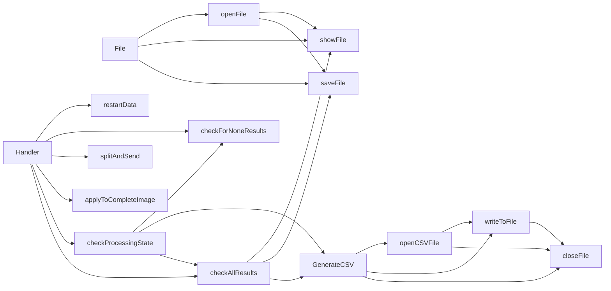
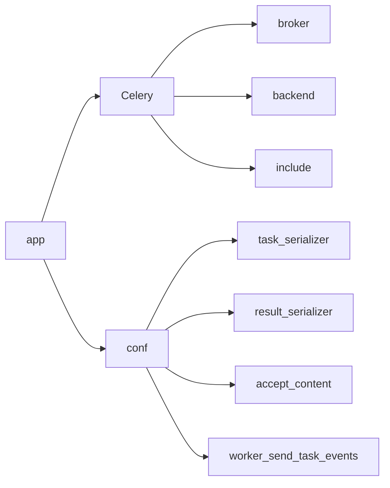

# 🖼️ Distributed Image Processing System

This is a program that performs various image processing functions defined in the `tasks.py` file using distributed workers. The operations include edge detection, image thresholding, scaling, translation, rotation, perspective transformation, smoothing by averaging or blurring, and applying the Laplacian derivative.

## Requirements

This program requires the installation of the Celery, NumPy, and SciPy libraries.

```zsh
pip install celery numpy scipy
```

## Function of `task.py`

The `tasks.py` defines a number of functions that perform various image processing operations. Here is a brief description of each function:

- `edgeDetection`: This function applies the Canny edge detection algorithm to an image, using the median of the image's pixel intensities as a threshold.
- `imageThresholding`: This function applies a simple threshold to an image, setting all pixels below a certain value to black and all others to white.
- `scaling`: This function scales an image.
- `translation`: This function translates (shifts) an image.
- `rotation`: This function rotates an image.
- `prespectiveTransformation`: This function applies a perspective transformation to an image.
- `smoothBy_Averaging`: This function smooths an image by averaging the pixel values within a kernel.
- `smoothBy_Blur`: This function smooths an image using a blur filter.
- `laplacianDerivative`: This function applies the Laplacian derivative to an image, which can be used for edge detection.

### Flowchart for `tasks.py`

```mermaid
graph LR
edgeDetection[Edge Detection] --> imageThresholding[Image Thresholding]
edgeDetection[Edge Detection] --> scaling[Scaling]
edgeDetection[Edge Detection] --> translation[Translation]
edgeDetection[Edge Detection] --> rotation[Rotation]
edgeDetection[Edge Detection] --> prespectiveTransformation[Prespective Transformation]
edgeDetection[Edge Detection] --> smoothBy_Averaging[Smooth by Averaging]
edgeDetection[Edge Detection] --> smoothBy_Blur[Smooth by Blur]
edgeDetection[Edge Detection] --> laplacianDerivative[Laplacian Derivative]
imageThresholding[Image Thresholding] --> scaling[Scaling]
imageThresholding[Image Thresholding] --> translation[Translation]
imageThresholding[Image Thresholding] --> rotation[Rotation]
imageThresholding[Image Thresholding] --> prespectiveTransformation[Prespective Transformation]
imageThresholding[Image Thresholding] --> smoothBy_Averaging[Smooth by Averaging]
imageThresholding[Image Thresholding] --> smoothBy_Blur[Smooth by Blur]
imageThresholding[Image Thresholding] --> laplacianDerivative[Laplacian Derivative]
scaling[Scaling] --> translation[Translation]
scaling[Scaling] --> rotation[Rotation]
scaling[Scaling] --> prespectiveTransformation[Prespective Transformation]
scaling[Scaling] --> smoothBy_Averaging[Smooth by Averaging]
scaling[Scaling] --> smoothBy_Blur[Smooth by Blur]
scaling[Scaling] --> laplacianDerivative[Laplacian Derivative]
translation[Translation] --> rotation[Rotation]
translation[Translation] --> prespectiveTransformation[Prespective Transformation]
translation[Translation] --> smoothBy_Averaging[Smooth by Averaging]
translation[Translation] --> smoothBy_Blur[Smooth by Blur]
translation[Translation] --> laplacianDerivative[Laplacian Derivative]
rotation[Rotation] --> prespectiveTransformation[Prespective Transformation]
rotation[Rotation] --> smoothBy_Averaging[Smooth by Averaging]
rotation[Rotation] --> smoothBy_Blur[Smooth by Blur]
rotation[Rotation] --> laplacianDerivative[Laplacian Derivative]
prespectiveTransformation[Prespective Transformation] --> smoothBy_Averaging[Smooth by Averaging]
prespectiveTransformation[Prespective Transformation] --> smoothBy_Blur[Smooth by Blur]
prespectiveTransformation[Prespective Transformation] --> laplacianDerivative[Laplacian Derivative]
smoothBy_Averaging[Smooth by Averaging] --> smoothBy_Blur[Smooth by Blur]
smoothBy_Averaging[Smooth by Averaging] --> laplacianDerivative[Laplacian Derivative]
smoothBy_Blur[Smooth by Blur] --> laplacianDerivative[Laplacian Derivative]

classDef lightMode fill:#FFFFFF, stroke:#333333, color:#333333;
classDef darkMode fill:#333333, stroke:#FFFFFF, color:#FFFFFF;

classDef lightModeLinks stroke:#333333;
classDef darkModeLinks stroke:#FFFFFF;

class edgeDetection,imageThresholding,scaling,translation,rotation,prespectiveTransformation,smoothBy_Averaging,smoothBy_Blur,laplacianDerivative lightMode;
class edgeDetection,imageThresholding,scaling,translation,rotation,prespectiveTransformation,smoothBy_Averaging,smoothBy_Blur,laplacianDerivative darkMode;

linkStyle 0 stroke:#FF4136, stroke-width:2px;
linkStyle 1 stroke:#1ABC9C, stroke-width:2px;
linkStyle 2 stroke:#0074D9, stroke-width:2px;
linkStyle 3 stroke:#FFCC00, stroke-width:2px;
linkStyle 4 stroke:#2ECC40, stroke-width:2px;
linkStyle 5 stroke:#B10DC9, stroke-width:2px;
linkStyle 6 stroke:#FF4136, stroke-width:2px;
linkStyle 7 stroke:#1ABC9C, stroke-width:2px;
linkStyle 8 stroke:#0074D9, stroke-width:2px;
linkStyle 9 stroke:#FFCC00, stroke-width:2px;
linkStyle 10 stroke:#2ECC40, stroke-width:2px;
linkStyle 11 stroke:#B10DC9, stroke-width:2px;
linkStyle 12 stroke:#FF4136, stroke-width:2px;
linkStyle 13 stroke:#1ABC9C, stroke-width:2px;
linkStyle 14 stroke:#0074D9, stroke-width:2px;
linkStyle 15 stroke:#FFCC00, stroke-width:2px;
linkStyle 16 stroke:#2ECC40, stroke-width:2px;
linkStyle 17 stroke:#B10DC9, stroke-width:2px;
linkStyle 18 stroke:#FF4136, stroke-width:2px;
linkStyle 19 stroke:#1ABC9C, stroke-width:2px;
linkStyle 20 stroke:#0074D9, stroke-width:2px;
linkStyle 21 stroke:#FFCC00, stroke-width:2px;
linkStyle 22 stroke:#2ECC40, stroke-width:2px;
linkStyle 23 stroke:#B10DC9, stroke-width:2px;
linkStyle 24 stroke:#FF4136, stroke-width:2px;
linkStyle 25 stroke:#1ABC9C, stroke-width:2px;
linkStyle 26 stroke:#0074D9, stroke-width:2px;
linkStyle 27 stroke:#FFCC00, stroke-width:2px;
linkStyle 28 stroke:#2ECC40, stroke-width:2px;
linkStyle 29 stroke:#B10DC9, stroke-width:2px;
linkStyle 30 stroke:#FF4136, stroke-width:2px;
linkStyle 31 stroke:#1ABC9C, stroke-width:2px;
linkStyle 32 stroke:#0074D9, stroke-width:2px;
linkStyle 33 stroke:#FFCC00, stroke-width:2px;
linkStyle 34 stroke:#2ECC40, stroke-width:2px;
linkStyle 35 stroke:#B10DC9, stroke-width:2px;

```



## Function of `client.py`

The `client.py` defines a `File` class that has methods for opening and showing images, as well as saving images. It also defines a `Handler` class that has methods for managing the processing of images using tasks defined in the `tasks` module. Here is a brief description of each method:

- `File.openFile`: This method opens an image file and returns the image as a NumPy array.
- `File.showFile`: This method displays an image using OpenCV.
- `File.saveFile`: This method saves an image to a specified directory.
- `Handler.restartData`: This method resets the task_ids and results dictionaries.
- `Handler.checkForNoneResults`: This method checks if any of the values in the results dictionary are None.
- `Handler.splitAndSend`: This method splits an image into chunks and sends each chunk to a task defined in the tasks module.
- `Handler.applyToCompleteImage`: This method sends an entire image to a task defined in the tasks module.
- `Handler.checkProcessingState`: This method checks the status of tasks and stores the results in the results dictionary.
- `Handler.checkAllResults`: This method retrieves the results of tasks and displays and saves the resulting images.

The `GenerateCSV` class has methods for creating and writing to a CSV file, as well as closing the file when finished.

### Flowchart for `client.py`



## Function of `celery_conf.py`

The `celery_conf.py` sets up a `Celery` instance named `app` that is used to run tasks in a distributed manner. The `Celery` instance is configured with a message broker (AMQP) and a result backend (Redis) to enable communication between tasks and workers. The `include` parameter specifies a list of modules containing tasks that the `Celery` instance should be able to run. The `task_serializer`, `result_serializer`, and `accept_content` parameters specify the serialization format for tasks and results, and the `worker_send_task_events` parameter enables task event support.

### Flowchart for `celery_conf.py`


